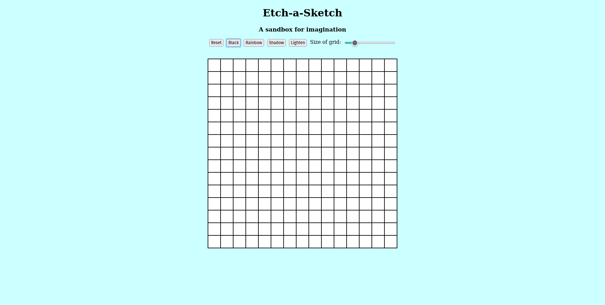

# Etch-a-Sketch

[Live Page](https://sebastienpj.github.io/Etch-a-Sketch/)

Here is my solution to the Etch-a-Sketch project fron The Odin project.

I used HTML, CSS, and Javascript to complete this project.

Topics learned and reinforced:
- DOM Manipulation:
  - Selecting elements using Javascript
  - Creating and Removing Elements
  - Adding Event Listeners to buttons
  - Modularity using functions
  - Troubleshooting (LOTS of it)
- Hover Effects using Event Listeners
- HTML and CSS Organization
- Flexbox properties

Thank you to The Odin Project for yet another challenging experience! This one pushed my understanding of Javascript to new heights. 
